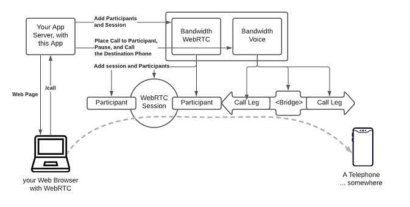
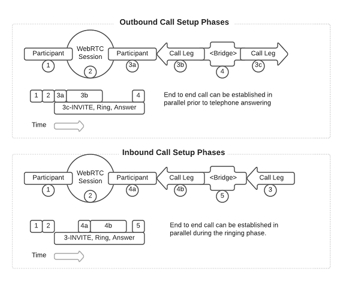

# Bridging WebRTC and Programmable Voice

This sample app takes a slightly different step down the path of communicating from a WebRTC-enabled browser client to telephone numbers in the real world. In this example we leverage the capabilities of the Bandwidth Programmable Voice platform and the <Bridge> verb, allowing the combination of a stable persistent webRTC session with one or more simple voice calls.

We want you to have access to the combined power of the Bandwidth WebRTC solution and the Programmable Voice solution - this sample demonstrates yet another of the approaches that you can take.

## Architecture Overview

This app runs an HTTP server that pushes a rudimentary React page, and then listens for requests from your browser to get connection information. The page will register itself when the main page launches, and establish the initial configuration that is used for subsequent telephone calls to all of those telephones out there in the real world.



The app creates a connection topology that uses the Bandwidth WebRTC capabilities to control the Browser media streams, and the Bandwidth Programmable Voice <Bridge> capabilities to control calls to telephones.

The app establishes a WebRTC Session with two Participants on the WebRTC side of the configuration. One of the Participants is used to represent the Browser, and one of the Participants is used to represent the connection to the Programmable Voice infrastructure. As is demonstrated in other sample applications, the WebRTC Session and Participant collection can be used to implement a wide variety of WebRTC media communication topologies, however in this case it will simply be used to connect to the Programmable Voice network.

On the Programmable Voice side of the configuration, the app will establish a 2-party <Bridge>, built upon a call to the WebRTC side of the topology using a SIP INVITE that includes an authentication token, thus interconnecting the two infrastructures with a secured media path.

Once the initial configuration has been established, the browser page can be used to establish outgoing telephone calls or receive inbound calls. Each time a call is initiated the /call API is used to create the call to both the WebRTC side and the Voice side of the communication, and the <Bridge> verb is uses on answering that call to join the voice and wwebRTC 'sides'. This example topology was chosen to demonstrate that once the initial configuration is established, many of the options provided by the comprehensive Programmable Voice product become available. In some sense the WebRTC endpoint is simply one of the legs in a bridged Programmable Voice call.

## Asycnhronous options

Since the WebRTC and the SIP Voice sides of the communication are established asynchronously, the two Programmable Voice calls that support that communication can be established asynchronously.

An attempt to render this visually for both an outbound call from WebRTC as well as for an inbound call to the WebRTC browser.



The bottom line is that there is sufficient delay in the human interaction parts of making a call that the legs can be set up independently and the call established in the background without impacting the interpersonal communication.

This sample application establishes both inbound and outbound calls in an asynchronous decoupled manner, enabling the setup of the WebRTC interconnection leg to be set up while the normal call handling of the voice leg of the call proceeds, and while the people responding to the calls react. This approach adds complexity to the sample application, but demonstrate the viability of this approach. A sequential approach can also be implemented.

> Note: This is a very simplistic demo and it is not designed to handle multiple browsers or multiple phones.
> Unless you are running on `localhost`, you will need to use HTTPS. Most modern browsers require a secure context when accessing cameras and microphones.

## An **IMPORTANT NOTE** about WebRTC Audio streams and browsers

One of the factors impacting WebRTC solutions is the way that streams of audio are handled by the browser.  The server may control the list of participants that are involved in a session, and control which endpoint receives which media stream, **but the browser client is responsible for responding to all of the streams that it receives.  If there are multiple participants sending audio to a browser, there will be multiple streams presented to the browser, and the browser needs to present them all to the DOM.**  You will see this behavior in this sample in the way in which the audioStreamPlayer is called multiple times for multiple streams.

This allows for uniform handling of audio and video streams, and the uniform handling of streams that transition from one state to another.

## Setting things up

To run this sample, you'll need a Bandwidth phone number, Voice API credentials and WebRTC enabled for your account. Please check with your account manager to ensure you are provisioned for WebRTC.

This sample will need be publicly accessible to the internet in order for Bandwidth API callbacks to work properly. Otherwise you'll need a tool like [ngrok](https://ngrok.com) to provide access from Bandwidth API callbacks to localhost.

### Create a Bandwidth Voice API application

Follow the steps in [How to Create a Voice API Application](https://support.bandwidth.com/hc/en-us/articles/360035060934-How-to-Create-a-Voice-API-Application-V2-) to create your Voice API appliation.

- In step 7 and 8, make sure they are set to POST.

- In step 9, provide the publicly accessible URL of your sample app. You need to add `/incomingCall` to the end of this URL in the Voice Application settings.

- You do no need to set a callback user id or password.

- Create the application and make note of your _Application ID_. You will provide this in the settings below.

### Configure your sample app

Copy the default configuration files

```bash
cp .env.default .env
```

Add your Bandwidth account settings to `.env`:

- BW_ACCOUNT_ID
- BW_USERNAME
- BW_PASSWORD

Add your Voice API application information:

- BW_VOICE_APPLICATION_ID
- BASE_CALLBACK_URL
- BW_NUMBER

You can ignore the other settings in the `.env.default` file.

### Install dependencies and build

```bash
npm install
npm start
```

### Communicate!

Browse to [http://localhost:5000](http://localhost:5000) and grant permission to use your microphone.

You should now be able to make calls using your browser! The web UI will indicate when you are connected. The format of the telephone number includes a +1 followed by 10 digits.

Enjoy!

### Adapt

If you want to make changes to the web page frontend component of the sample, ensure that you ...

```
npm run postinstall
```

... after you make and save your changes, to ensure that a replacement front end is installed.
